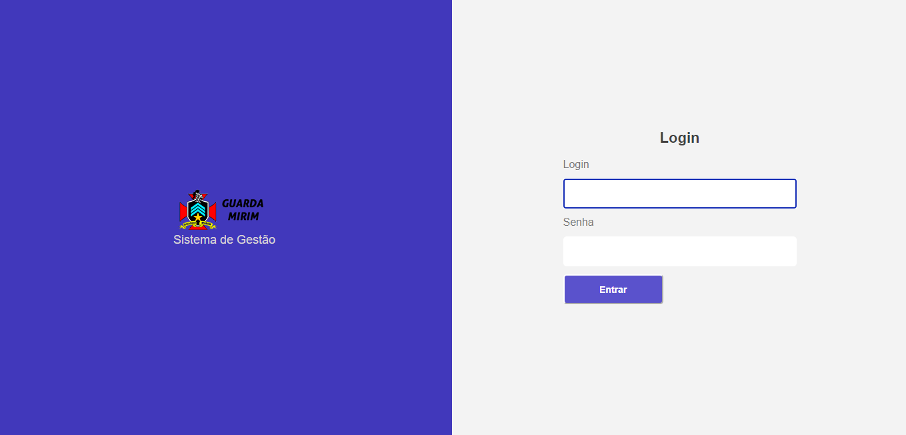
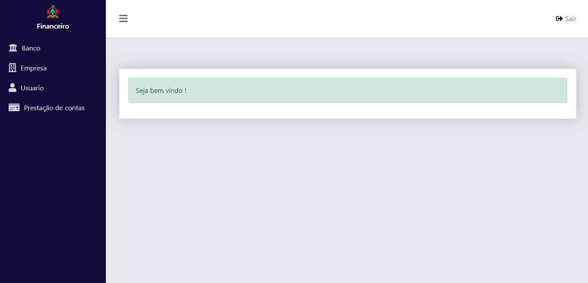
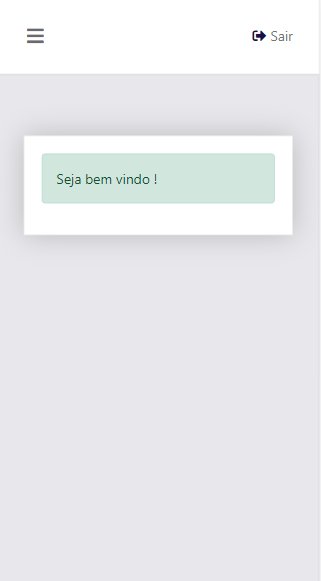

# Dashboard admin Guarda Mirim Frutal MG 

### General info:

It has an agile panel to manage the company, transforming the data into easy to understand and relevant information.

### Technologies:

- HTML 5;
- CSS ;
- JS;
- JQUERY;
- BOOTSTRAP 5.0.1.

### login responsive:

### Dashboard:

- Desktop:

- Mobile:

